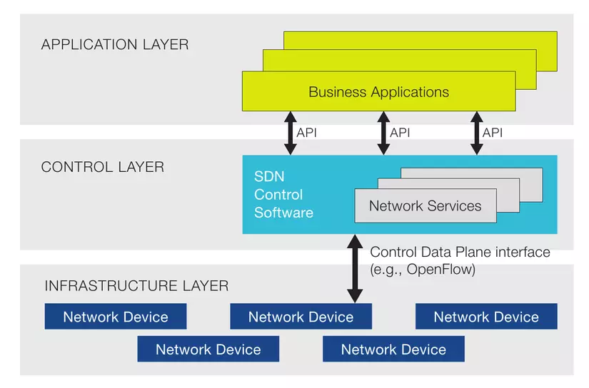
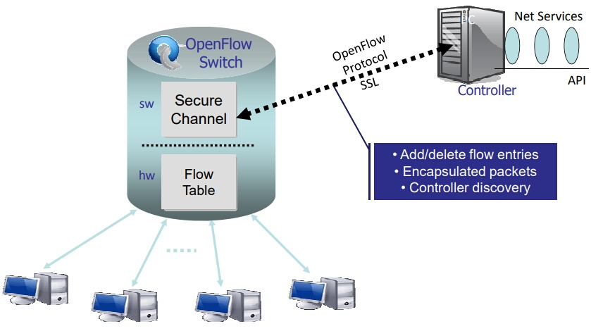
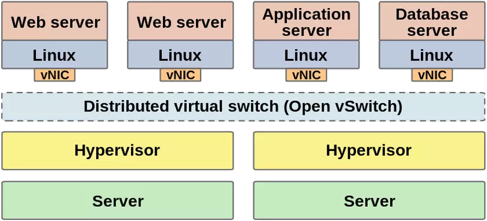
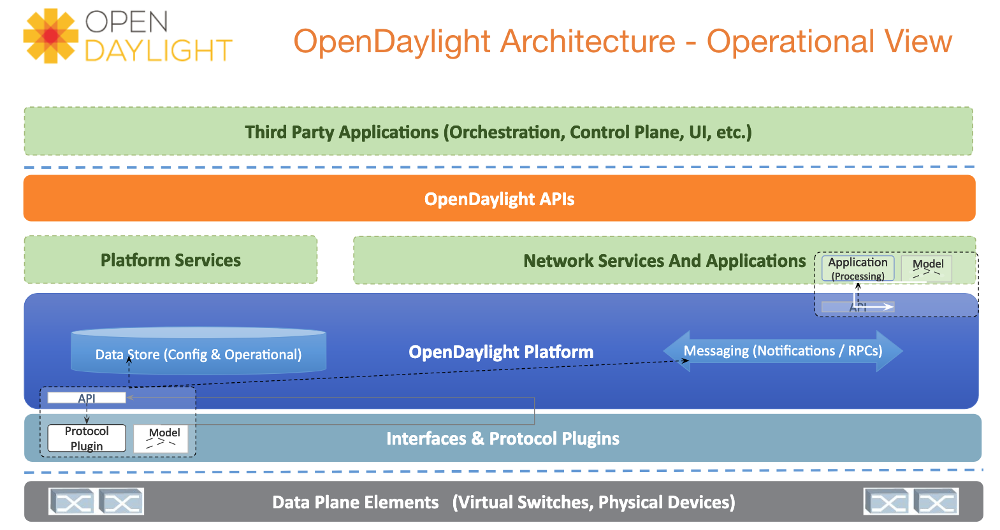
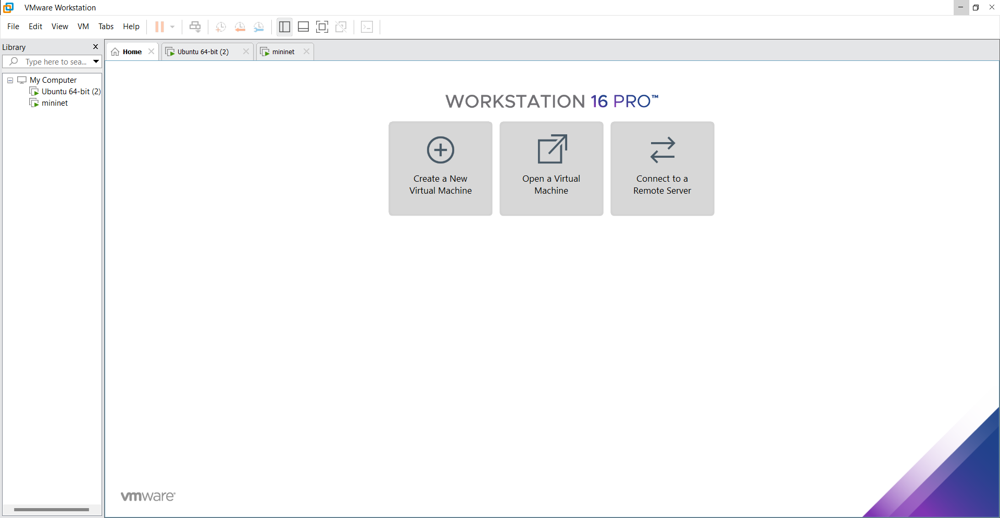
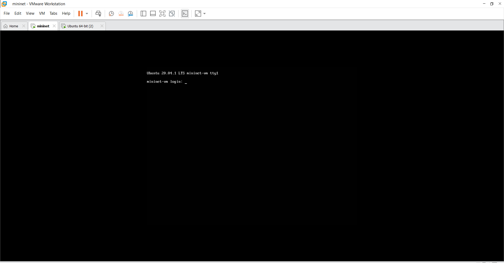
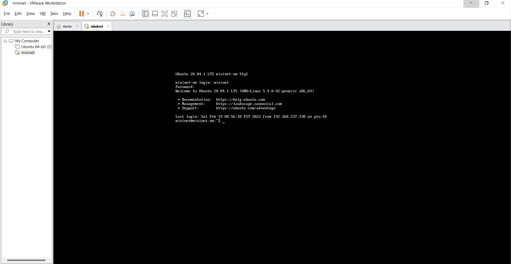

<h1><b>Software Defined Networking</b><h1>

<h2><b>I. Giới thiệu chung</b><h2>

<h3><b>1.1 Mininet</b></h3>

- <b>Mininet</b> là một công cụ giả lập mạng, bao gồm tập hợp các hosts đầu cuối, các switches, routers và các liên kết trên một <b>Linux kernel</b>. 

- <b>Mininet</b> sử dụng công nghệ ảo hóa (ở mức đơn giản) để tạo nên hệ thống mạng hoàn chỉnh, chạy chung trên cùng một kernel, hệ thống và user code.

- Các host ảo, switch, liên kết và các controller trên mininet là các thực thể thực sự, được giả lập dưới dạng phần mềm thay vì phần cứng.

-  Một host mininet có thể thực hiện <b>SSH</b>(Secure Shell) vào đó, chạy bất kì phần mềm nào đã cài trên hệ thống linux (môi trường mà mininet đang chạy). Các phần mềm này có thể gửi gói tin thông các ethernet interface của mininet với tốc độ liên kết và trễ đặt trước.

- <b>Mininet</b> cho phép tạo topo mạng nhanh chóng, tùy chỉnh được topo mạng, chạy được các phần mềm thực sự như web servers, TCP monitoring, Wireshark; tùy chỉnh được việc chuyển tiếp gói tin.
 
- <b>Mininet</b> cũng dễ dàng sử dụng và không yêu cầu cấu hình đặc biệt gì về phần cứng để chạy: mininet có thể cài trên laptop, server, VM, cloud (linux).


<h3><b>1.2 Software Defined Networking</b></h3>

- SDN hay mạng điều khiển bằng phần mềm (Software Defined Networking) được dựa trên cơ chế tách riêng việc kiểm soát một luồng mạng với luồng dữ liệu (control plane và data plane).

- SDN dựa trên giao thức luồng mở (Open Flow) và là kết quả nghiên cứu của Đại học Stanford và California Berkeley. 
 
- SDN tách định tuyến và chuyển các luồng dữ liệu riêng rẽ và chuyển kiểm soát luồng sang thành phần mạng riêng có tên gọi là thiết bị kiểm soát luồng (Flow Controller). Điều này cho phép luồng các gói dữ liệu đi qua mạng được kiểm soát theo lập trình. 
 
- Trong SDN, control plane được tách ra từ các thiết bị vật lý và chuyển đến các bộ điều khiển. Bộ điều khiển này có thể nhìn thấy toàn bộ mạng lưới, và do đó cho phép các kỹ sư mạng làm cho chính sách chuyển tiếp tối ưu dựa trên toàn bộ mạng. 
 
- Các bộ điều khiển tương tác với các thiết bị mạng vật lý thông qua một giao thức chuẩn OpenFlow. Kiến trúc của SDN gồm 3 lớp riêng biệt: lớp ứng dụng, lớp điều khiển, và lớp cơ sở hạ tầng (lớp chuyển tiếp).




<h3><b>1.3 Kiến trúc SDN</b></h3>

- <b>Lớp ứng dụng:</b> Là các ứng dụng kinh doanh được triển khai trên mạng, được kết nối tới lớp điều khiển thông qua các API, cung cấp khả năng cho phép lớp ứng dụng lập trình lại (cấu hình lại) mạng (điều chỉnh các tham số trễ, băng thông, định tuyến, …) thông qua lớp điều khiển.

- <b>Lớp điều khiển:</b> Là nơi tập trung các bộ điều khiển thực hiện việc điều khiển cấu hình mạng theo các yêu cầu từ lớp ứng dụng và khả năng của mạng. Các bộ điều khiển này có thể là các phần mềm được lập trình.

- <b>Lớp cơ sở hạ tầng:</b> Là các thiết bị mạng thực tế (vật lý hay ảo hóa) thực hiện việc chuyển tiếp gói tin theo sự điều khiển của lớp điểu khiển. Một thiết bị mạng có thể hoạt động theo sự điều khiển của nhiều bộ điều khiển khác nhau, điều này giúp tăng cường khả năng ảo hóa của mạng.

<h3><b>1.4 OpenFlow</b> </h3>

- OpenFlow là tiêu chuẩn đầu tiên, cung cấp khả năng truyền thông giữa các giao diện của lớp điều khiển và lớp chuyển tiếp trong kiến trúc SDN. 

- OpenFlow cho phép truy cập trực tiếp và điều khiển mặt phẳng chuyển tiếp của các thiết bị mạng như switch và router, cả thiết bị vật lý và thiết bị ảo, do đó giúp di chuyển phần điều khiển mạng ra khỏi các thiết bị chuyển mạch thực tế tới phần mềm điều khiển trung tâm.

- Các quyết định về các luồng traffic sẽ được quyết định tập trung tại OpenFlow Controller giúp đơn giản trong việc quản trị cấu hình trong toàn hệ thống. 



<h3><b>1.5 Các thành phần của OpenFlow</b></h3>

- <b>Secure Channel:</b> kênh kết nối thiết bị tới bộ điều khiển (controller), cho phép các lệnh và các gói tin được gửi giữa bộ điều khiển và thiết bị.

- <b>OpenFlow Protocol:</b> giao thức cung cấp phương thức tiêu chuẩn và mở cho một bộ điều khiển truyền thông với thiết bị.

- <b>Flow Table:</b> một liên kết hành động với mỗi luồng, giúp thiết bị xử lý các luồng thế nào.

<h3><b>1.6 OpenvSwitch </b></h3>

- <b>OpenvSwitch(OVS)</b> là một dự án về chuyển mạch ảo đa lớp (multilayer). Mục đích chính của OpenvSwitch là cung cấp lớp chuyển mạch cho môi trường ảo hóa phần cứng, trong khi hỗ trợ nhiều giao thức và tiêu chuẩn được sử dụng trong hệ thống chuyển mạch thông thường.

- <b>OpenvSwitch</b> hỗ trợ nhiều công nghệ ảo hóa dựa trên nền tảng Linux như Xen/XenServer, KVM, và VirtualBox.

- <b>OpenvSwitch</b> hỗ trợ các tính năng sau: - VLAN tagging & 802.1q trunking - Standard Spanning Tree Protocol (802.1D) - LACP - Port Mirroring (SPAN/RSPAN) - Tunneling Protocols - QoS



<h3><b>1.7 Các thành phần chính của OpenvSwitch</b></h3>

- <b>ovs-vswitchd:</b> thực hiện chuyển đổi các luồng chuyển mạch.

- <b>ovsdb-server:</b> là một <b>lightweight database server</b>, cho phép <b>ovs-vswitchd</b> thực hiện các truy vấn đến cấu hình.

- <b>ovs-dpctl:</b> công cụ để cấu hình các <b>switch kernel module</b>.

- <b>ovs-vsctl:</b> tiện ích để truy vấn và cập nhật cấu hình <b>ovs-vswitchd</b>.

- <b>ovs-appctl:</b> tiện ích gửi command để chạy <b>OpenvSwitch</b>.


<h3><b>1.8 OpenDaylight SDN Controller</b></h3>

- <b>OpenDaylight</b> là phần mềm mã nguồn mở dành cho <b>Software Defined Networking (SDN)</b> sử dụng giao thức mở cung cấp khả năng kiểm soát tập trung, có khả năng lập trình được và theo dõi các thiết bị mạng. Giống như nhiều <b>SDN Controllers</b> khác, <b>OpenDaylight</b> hỗ trợ <b>OpenFlow</b>, cũng như cung cấp các giải pháp mạng khác sẵn sàng để cài đặt khi có yêu cầu.

- <b>OpenDaylight</b> cung cấp giao diện cho phép kết nối các thiết bị mạng nhanh chóng và thông minh để tối ưu hiệu năng mạng

- <b>OpenDaylight Controller</b> cung cấp <b>northbound APIs</b>, được sử dụng bởi các ứng dụng. Các ứng dụng này sử dụng controller để thu thập thông tin về mạng, chạy các thuật toán để kiểm soát, phân tích, sau đó sử dụng <b>OpenDaylight Controller</b> tạo các rules mới cho mạng.

- <b>OpenDaylight Controller</b> viết bằng ngôn ngữ <b>Java</b>, có nghĩa là có thể sử dụng <b>OpenDaylight Controller</b> trên bất kì môi trường nào hỗ trợ <b>Java</b>. Tuy nhiên để đạt hiệu năng tốt nhất, <b>OpenDaylight</b> nên chạy trên môi trường Linux hỗ trợ <b>JVM tối thiểu 1.7</b>.



<h2><b>II. Xây dựng mạng SDN đơn giản</b></h2>

Thành phần của mạng SDN gồm:

- Một bộ điều khiển
- Ba Switch
- Bốn Host

<h3><b>2.1 Các bước thực hiện</b></h3>

- Bước 1: Tải MobaXterm tại https://mobaxterm.mobatek.net

  
- Bước 2: Cài đặt VMware Workstation 16 Pro tại https://www.vmware.com/products/workstation-pro/workstation-pro-evaluation.html


- Bước 3: Cài đặt Mininet tại http://mininet.org/download hoặc từ Github tại https://github.com/mininet/mininet/releases


- Bước 4: Khởi động VMware Workstation





- Bước 5: Tiến hành cài đặt Mininet trên VMware Workstation




- Bước 6: Đăng nhập vào Mininet với user là mininet và password là mininet.



- Bước 7: Kiểm tra trạng thái SSH Server bằng lệnh: 
  
  ```
  systemctl status sshd
  ```

- Bước 8: Kiểm tra địa chỉ ip của máy ảo Mininet bằng lệnh: 
  
 ```
  ip addr
 ```


- Bước 9: Khởi động MobaXterm, thực hiện thao tác để mở cửa sổ kết nối SSH tới server Mininet. 

- Bước 10: Ta chọn tab <b>Section</b> sau đó chọn <b>New section</b>.
Ngoài ra, có thể thực hiện tổ hợp phím 

```
Ctl + Shif + N
```

  - Cửa sổ mới hiện ra sau thao tác trên, chọn tab <b>SSH</b>.

  - Tại cửa sổ trên, tiến hành nhập địa chỉ IP và port của máy chủ. Thường thì mặc định giá trị port SSH sẽ là 22.
  
- Bước 11: Nhập đầy đủ các thông tin sau:
	
	- Remote host: điền địa chỉ IP của máy ảo Mininet: `192.168.237.131`
	- Port: Điền port SSH của máy chủ, mặc định là: `22`
	- Specify username: `mininet`
	- Sau khi nhập xong, chọn `OK`

- Bước 12: Sau khi chọn `OK`, ta sẽ có giao diện để nhập user và mật khẩu của máy chủ, tiến hành nhập mật khẩu:
  
```
mininet
```

<h3><b>2.2 Các bước tạo topo mạng</b></h3>

- Bước 1: Tạo file trống chứa mã python tạo ra mô hình SDN bằng lệnh sau:

``` 
touch topo3s4h.py
```

- Bước 2: Để soạn mã trong file topo3s4h.py ta sử dụng lệnh `vi`

```
vi topo3s4h.py 
```

- Bước 3: Dùng lệnh `i` để vào chế độ `Insert` và tiến hành soạn mã.
  
- Bước 4: Sao chép và dán đoạn mã sao vào file <b>topo3s4h.py</b>
  
```

from mininet.topo import Topo
class MyTopo(Topo):

    def __init__(self):
        "Create custom topo."

        Topo.__init__(self)
        # add host
        h1 = self.addHost('h1')
        h2 = self.addHost('h2')
        h3 = self.addHost('h3')
        h4 = self.addHost('h4')

        # add switch
        s1 = self.addSwitch('s1')
        s2 = self.addSwitch('s2')
        s3 = self.addSwitch('s3')

        # add connection
        self.addLink(s1, s2)
        self.addLink(s1, s3)
        self.addLink(s2, h1)
        self.addLink(s2, h2)
        self.addLink(s3, h3)
        self.addLink(s3, h4)
topos = {'tp': (lambda: MyTopo())}

```

- Bước 5: Sau khi thiết lập xong ta nhấn <b>Esc</b> để thoát khỏi chế độ Insert và dùng lệnh `:wq` hoặc `:x!` để lưu cấu hình và thoát.


<h3><b>2.3 Thực thi lệnh tạo topo mạng</b></h3>

- Bước 1: Sử dụng lệnh để thực thi tạo topo mạng

```
sudo mn --custom topo3s4h.py --topo tp --mac --switch ovsk--controller remote

```

  - Chú thích: 
    - `sudo mn` để khởi tạo một mạng mininet
    
    - `--custom` để đọc các lớp và các thông số từ file .py 
    
    - `--topo` để tạo cấu trúc liên kết và file tạo ở đây là tp 
    
    - `--mac` tự động đặt địa chỉ MAC
    
    - `--switch ovsk` để tạo bộ chuyển mạch Openvswitch dựa vào nhân hệ điều hành ovsk 
  
- Sau khi chạy thành công sẽ xuất ra màn hình 1 bộ điều khiển, 4 host và 3 switch. 

- Với lệnh trên ta đã khởi tạo một mạng gồm: một chuyển mạch Open vSwitch được tạo ra dựa vào nhân của hệ điều hành (ovsk) trong một namespace riêng, bộ điều khiển nằm bên ngoài máy ảo của switch và giao tiếp với switch thông qua port 127.0.0.1:6653.

<h3>2.4 Kiểm tra các kết nối của mạng</h3>

Thực hiện các lệnh sau: 

- `net`: hiển thị interface trong các node.
- `dump`: hiển thị thông tin chi tiết tất cả các node.
- `nodes`: hiển thị các node hiện tại.
- `links`: hiển thị các đường truyền.

<h3><b>2.5 Tạo luồng cho các host và switch</b></h3>

- Bước 1: Dùng trình tiện ích ovs-ofctl để kiểm tra tính năng và bảng luồng của switch s1, s2, s3. Sử dụng lệnh sau:

```

sh ovs-ofctl show s1
sh ovs-ofctl show s2
sh ovs-ofctl show s3

```

- Bước 2: Tiến hành ping từ h1 sang h3: 
  
```
h1 ping -c1 h3

```

- Sau khi ping ta thấy chưa có kết nối giữa các host vì trong bảng luồng không có một mục luồng nào cho các kết nối này.


- Bước 3: Tạo các kết nối này ta dùng trình tiện ích `ovs-ofctl` để tạo các mục luồng tương ứng trong bảng luồng. Sử dụng lệnh: 

```
sh ovs-ofctl add-flow s1 in_port=1,actions=output:normal
sh ovs-ofctl add-flow s1 in_port=2,actions=output:normal
sh ovs-ofctl add-flow s2 in_port=1,actions=output:normal
sh ovs-ofctl add-flow s2 in_port=2,actions=output:normal
sh ovs-ofctl add-flow s2 in_port=3,actions=output:normal
sh ovs-ofctl add-flow s3 in_port=1,actions=output:normal
sh ovs-ofctl add-flow s3 in_port=2,actions=output:normal
sh ovs-ofctl add-flow s3 in_port=3,actions=output:normal

```
- Chú thích: 

  - Với s1 là <b>tên switch</b>, in_port là <b>cổng vào</b>, output là <b>cổng ra</b>.

  - Với câu lệnh trên luồng sẽ được tạo đi từ cổng 1 của switch 1 ra tất cả cổng còn lại. Nếu thay normal bằng số, thì luồng sẽ ra theo cổng số được chỉ định.


- Bước 4: Sau đó kiểm tra lại các entry lần lượt bằng câu lệnh

```

sh ovs-ofctl dump-flows s1
sh ovs-ofctl dump-flows s2
sh ovs-ofctl dump-flows s3

```

- Bước 5: Kiểm tra lại các kết nối trong mạng. Sử dụng lệnh:

```
pingall

```

- Ta thấy kết quả 0% dropped (12/12 received), vậy sau khi tạo luồng các host đã kết nối được với nhau.

<h3><b>2.6 Phân tích các bản tin giao thức OpenFlow khi khởi động mạng, ping và tạo luồng</b></h3>

- Bước 1: Mở một session Mininet trên MobaXterm, đăng nhập với mật khẩu mininet và tiến hành khởi động Wireshark bằng lệnh:

```
 sudo -E wireshark

```

- Bước 2: Chọn cổng tiến hành capture: 
  
```  
Loopback.lo

```

- Bước 3: Tại mục filter nhập ```openflow_v1``` để lọc gói tin openflow phiên bản 1.0 và nhấn ```Enter```

- Bước 4: Khởi tạo mạng SDN và tiến hành bắt gói tin trên ```Wireshark```

- Bước 5: Mở một session Mininet khác trên MobaXterm và đăng nhập với mật khẩu ```mininet```, tiến hành chạy mạng đã tạo bằng câu lệnh:

```
sudo mn --custom topo3s4h.py --topo tp --mac --switch ovsk

```

- Bước 6: Thực hiện phân tích bản tin.

<h3><b>2.7 Cài đặt OpenDaylight SDN Controller</b></h3>

- Bước 1: Cài đặt JAVA trên Ubuntu sử dụng lệnh:
  
```

sudo apt-get -y install openjdk-8-jre
sudo update-alternatives --config java

```

- Bước 2: Truy cập vào ```nano ~/.bashrc``` xuống cuối cùng dán đoạn lệnh sau và lưu lại:

```
export JAVA_HOME=/usr/lib/jvm/java-8-openjdk-amd64/jre 

```

- Bước 3: Kiểm tra lại đường dẫn bằng lệnh:

```
source ~/.bashrc
echo $JAVA_HOME

```

- Bước 4: Tải về OpenDaylight SDN Controller bằng dòng lệnh sau:

```
wget https://nexus.opendaylight.org/content/groups/public/org/opendaylight/integration/distribution-karaf/0.6.4-Carbon/distribution-karaf-0.6.4-Carbon.tar.gz

```

- Bước 5: Sau khi tải về thành công, ta giải nén file bằng lệnh:

```

tar -xvf distribution-karaf-0.6.4-Carbon.tar.gz

```

- Bước 6: Truy cập vào thư mục vừa giải nén và chạy OpenDaylight

```

cd distribution-karaf-0.6.4-Carbon/

./bin/karaf

```

- Bước 7: Kiểm tra các tính năng đã cài trên OpenDaylight bằng lệnh:

```

feature:list --installed

```

- Bước 8: Tiến hành cài thêm các tính năng cho OpenDaylight:

```
feature:install odl-restconf odl-l2switch-switch

feature:install odl-dluxapps-applications odl-dluxapps-nodes odl-dluxapps-topology odl-dluxapps-yangui odl-dluxapps-yangman odl-dluxapps-yangvisualizer odl-dluxapps-yangutils odl-dlux-core

```

- Bước 9: Mở một session Ubuntu khác trên MobaXterm
- Bước 10: Cài npm (npm là 1 chương trình để quản lý thư viện trong môi trường JAVA Node.js) bằng các lệnh sau:

```
sudo apt-get install -y npm
sudo apt-get install -y nodejs-legacy

```

- Bước 11:  Cài Opendaylight-openflow-app bằng các lệnh sau:

```

sudo apt install git
git clone https://github.com/CiscoDevNet/OpenDaylight-OpenFlowApp.git
cd OpenDaylight-OpenFlow-App/
sudo npm install -g grunt-cli
sudo nano ./ofm/src/common/config/env.module.js

```

- Bước 12: Tại đây chúng ta sẽ tiến hành sửa nội dung trong env.module.js, ta sửa localhost thành ip của máy Ubuntu đang chạy Opendaylight và lưu lại. Sau đó sử dụng lệnh:

```
sudo grunt

```

<h3><b>2.8 Triển khai bộ điều khiển OpenDaylight</b></h3>

- Bước 1: Giữ nguyên 2 session <b>Ubuntu</b> đã cài đặt và chạy <b>OpenDaylight</b> cũng như <b>Opendaylight-openflow-app</b>.
  
- Bước 2: Mở một session <b>Mininet</b> trên <b>MobaXterm</b>, tiến hành đăng nhập và nhập lệnh:
  
```
sudo mn --topo linear,3 --mac --controller=remote,ip=192.168.237.131,port=6633 --custom topo3s4h.py --topo tp --switch ovs,protocols=OpenFlow13

```

- Với ip là địa chỉ ip của máy ubuntu đang chạy OpenDaylight.

- Bước 3: Tiến hành kiểm tra lại kết nối trong mạng: 

```

pingall

```

- Bước 4: Mở trình duyệt web để vào giao diện điều khiển:
  + Gõ vào khung search: http://192.168.237.137:8181/index.html
  + Nếu có yêu cầu login thì user name và mật khẩu mặc định là: admin
  + Vào thẻ Topology sẽ thấy được topo mạng đã tạo.

- Bước 5: Tạo sự cố mạng: đường nối giữa Switch 1 (S1), Switch 2 (S2) và Switch 3 (S3) bị đứt. Tiến hành nhập lệnh trên Mininet:
  
```

link s1 s2 down
link s1 s3 down

```


